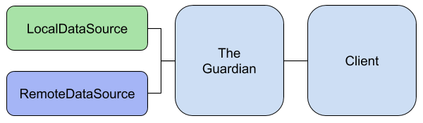
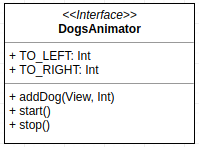

# IDdogChallenge

<p align="center">
  
</p>

1. [Introdução](#introduction) 
2. [Requisitos](#requirements) 
3. [Arquitetura](#architecture) 
   * [Login](#login) 
   * [Animação](#animation) 
4. [Instalação](#setup)  
5. [Licença](#license)
<a name="introduction" />

## Introdução

A startup [**IDwall**](https://idwall.co/), propõe um desafio de desenvolvimento de aplicativo que consome os dados da **API IDdog**.  Com isso surgiu a versão que está neste repositório :)
<a name="requirements" />

## Requisitos

Criar uma aplicação para Android que utiliza a **API IDdog** com os seguintes princípios:

 1. Criar uma tela de login, apenas com email;
 2. Armazenar o token retornado localmente;
 3. Após login redirecionar para tela de feed;
 4. Criar opção do usuário percorrer as imagens entre as quatro raças de cachorros disponíveis na API (Husky, Labrador, Hound e Pug);
 5. Fazer cache das imagens;
 6. Ao clicar na imagem, deve abrir em tela cheia.
<a name="architecture" />

## Arquitetura

Um aplicativo, em sua maioria, deve ser feito desde o começo pensando em escalabilidade e manutenções futuras. Afim de ganhar maior modularização e facilitar criações futuras de libs internas necessárias para o negócio, foi tomado as decisões abaixo:
<a name="login" />

### Login

Os requisitos do projeto mostram que o aplicativo deve fazer login em uma API específica, tendo como retorno um token, que depois é armazenado localmente. 

Para atender os requisitos e facilitar manutenções futuras, foi criado uma estrutura de *package by feature*. O login foi separado do resto da aplicação, expondo apenas uma interface de comunicação intitulada ```TheGuardian``` (nome massa, não?! :D ). Ele fica sendo o responsável por dizer se o usuário pode entrar no app.

<p align="center">
  
</p>

Caso futuramente a empresa ganhe mais produtos (IDcat, IDtiger etc), ```TheGuardian``` pode ser retirado do IDdog e virar uma biblioteca interna de login único da empresa, tipo o tio Google com Google SignIn.

Internamente, ```TheGuardian```, utiliza o pattern Repository que coordena dois data sources.

**RemoteDataSource** possui uma implementação para requisitar dados de login para API IDdog, neste caso, o token baseado no usuário.

**LocalDataSource** possui uma implementação que armazena o token do usuário no ```AccountManager``` do Android. Isso possibilita fazer com o que usuário fique sempre logado e o token armazenado com mais segurança, já que apenas aplicação com mesmo ```applicationId``` pode recuperar.
<a name="animation" />

### Animações

A tela de login apresenta uma animação onde cães, das quatro raças utilizadas pela API, ficam surgindo aleatoriamente. 

**Considerações:**

Foi utilizado o ```AnimatorSet```, disponibilizado pelo SDK. Por ser quatro elementos diferentes sendo coordenados, é preciso fazer um estudo mais afundo, já que, segundo documentação do Google, AnimatorSet utiliza reflection podendo apresentar problemas de performance em smartphones mais simples.

Para ter um código mais desacoplado e facilitar futuras tentativas de melhoria de performance, a coordenação das animações foi isolada da ```Activity``` de login.

<p align="center">
  
</p>

Isso possibilitou injetar na ```Activity``` apenas a implementação da interface. Exemplo de utilização:

```kotlin
dogsAnimator.addDog(imageviewPug, DogsAnimator.TO_LEFT)
dogsAnimator.addDog(imageviewLabrador, DogsAnimator.TO_RIGHT)

dogsAnimator.start()
```
<a name="resources" />

## Recursos

Para alcançar os objetivos da arquitetura proposta, foi decidido utilizar os seguintes recursos:

 1. **Clean Architecture**, como base na criação de uma feature, tentando minimizar overengineering;
 2. **Kotlin**, como linguagem de programação;
 3. **Dagger2**, para injeção de dependências;
 4. **RxJava2**, para ajudar a ter uma arquitetura mais reativa;
 5. **Retrofit**, para requisições HTTP, com rxAdapter;
 6. **Picasso**, para carregar imagens;
 7. **Timber**; para não perder o costume :P
<a name="setup" />

## Instalação

Para rodar esse projeto utilize uma das seguintes formas:

Instale o APK disponível na seção de release

ou

Clone o repositório na sua máquina.
Faça o build da aplicação utilizando Android Studio ou via terminal com ```./gradlew assembleDebug```

<a name="license" />

## Licença
<aside class="notice">
  
Copyright 2018 Victor Vieira Paulino

Licensed under the Apache License, Version 2.0 (the "License");
you may not use this file except in compliance with the License.
You may obtain a copy of the License at

    http://www.apache.org/licenses/LICENSE-2.0

Unless required by applicable law or agreed to in writing, software
distributed under the License is distributed on an "AS IS" BASIS,
WITHOUT WARRANTIES OR CONDITIONS OF ANY KIND, either express or implied.
See the License for the specific language governing permissions and
limitations under the License.

</aside>
